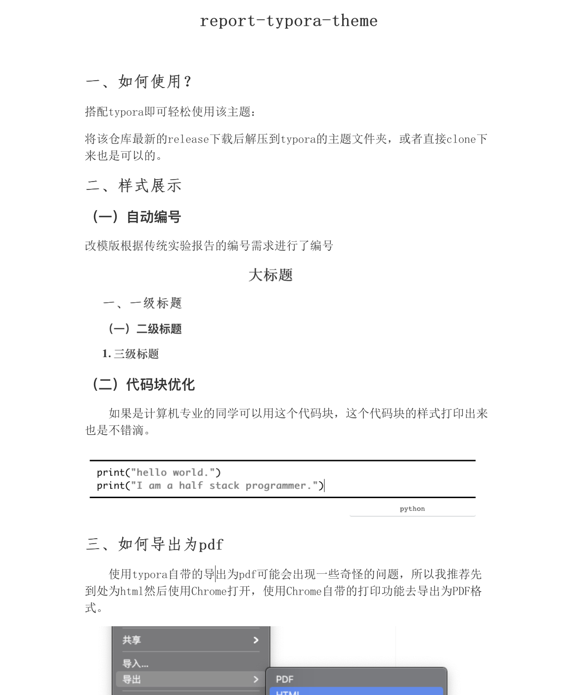

# report-typora-theme

## 如何使用？

搭配typora即可轻松使用该主题：

可参见[Typora官方主题文档](http://support.typora.io/About-Themes/)

太长不看版:

1. 打开Typora
2. 菜单栏“文件”选项卡-偏好设置（Ctrl +,）
3. 外观-主题-打开主题文件夹themes
4. 将下载的report-essay.css文件放入此文件夹
5. 重启Typora，打开xxx.md文件
6. 菜单栏“主题”选项卡: report-essay

## 样式展示

### 自动编号

改模版根据传统实验报告的编号需求进行了编号

### 代码块优化

​	如果是计算机专业的同学可以用这个代码块，这个代码块的样式打印出来也是不错滴。

## 如何导出为pdf

​	使用typora自带的导出为pdf可能会出现一些奇怪的问题，所以我推荐先到处为html然后使用Chrome打开，使用Chrome自带的打印功能去导出为PDF格式。

接下来使用Chrome自带的导出（Ctrl/Commond+P）上下边距调整为25.5mm就可以导出一个完美的报告啦！

## 声明

​	该代码的代码在[该仓库](https://github.com/du33169/typora-theme-essay_cn)的记录上进行修改，并非100%本人完成，模版只是自用。希望给各位苦逼的报告人节省一些时间。

